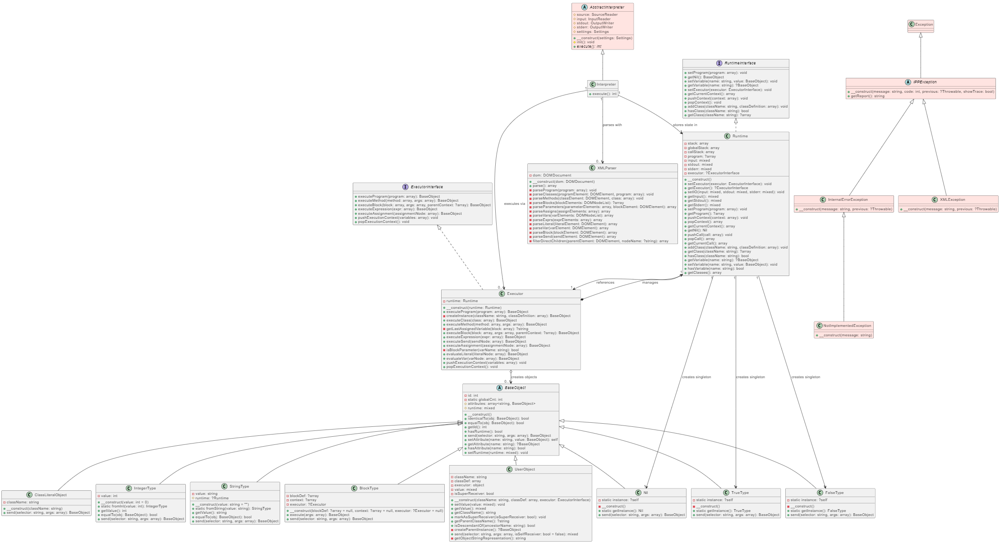

# IPP XML interpreter documentation
**Author:**
Denys Malytskyi
xmalytd00

## Interpreter structure

## Classes description

### Interpreter Class

This class is the main entry point fore the program. It passes XML input into `XMLParser` class. After that it initializes runtime environment, sets up input/output streams. Then it creates an `Executor` instance to execute parsed program.   

### XMLParser Class

This class is responsible for parsing the XML input. It parses said input and extracts variables, literals, expressions, and message sends from the XML. Produces a nested associative array (AST) representing the program structure.

### Executor class

The Executor class is responsible for executing the program represented as an AST. It has a single attribute, runtime, which is an instance of the Runtime class used to store the program state and manage execution contexts. The Executor loads all classes from the program (`executeProgram()`), creates instances of classes (`createInstance()`), and executes methods (`executeMethod()`), blocks (`executeBlock()`), expressions (`executeExpression()`), assignments (`executeAssignment()`), and message sends (`executeSend()`). It also provides utility methods for evaluating literals (`evaluateLiteral()`), variables (`evaluateVar()`), and for managing execution contexts (`pushExecutionContext()`, `popExecutionContext()`). The class ensures proper error handling by throwing exceptions when required program elements are missing or invalid.

### Runtime class

The Runtime class implements the RuntimeInterface and is responsible for managing the execution environment of the program. It maintains a stack of execution contexts (`pushContext`, `popContext`, `getCurrentContext`), a call stack for method calls (`pushCall`, `popCall`, `getCurrentCall`), and a global storage for singleton objects and class definitions. The class provides methods to set and retrieve the program AST (`setProgram`, `getProgram`), manage input/output streams (`setIO`, `getInput`, `getStdout`, `getStderr`), and handle variables in the current context (`setVariable`, `getVariable`, `hasVariable`). It also manages class definitions (`addClass`, `getClass`, `hasClass`, `getClasses`) and provides access to singleton objects like nil (`getNil`). The class ensures proper context and variable management during program execution and supports class-based object-oriented features.

### FalseType, TrueType, Nil classes (singletons)

The Nil, TrueType, and FalseType classes represent the singleton objects for the logical values nil, true, and false in the program. Each class ensures that only one instance exists using the `getInstance()` method, which returns the singleton instance. These classes inherit from BaseObject and override the `send()` method to handle message passing according to their logical semantics.

- The Nil class represents the nil value and responds to selectors such as `asString`, `isNil`, `new`, `from:`, and `greaterThan:` in the `send()` method, returning appropriate singleton objects or string representations.

- The TrueType class represents the logical true value and handles selectors like `not`, `and:`, `or:`, `ifTrue:ifFalse:`, `asString`, `new`, and `from:` in the `send()` method, implementing logical operations and conditional execution.

- The FalseType class represents the logical false value and processes selectors such as `not`, `and:`, `or:`, `ifTrue:ifFalse:`, `asString`, `new`, and `from:` in the `send()` method, providing the correct logical behavior and conditional branching.

All three classes use the singleton pattern for efficient memory usage and consistent identity, and provide logical operations and conversions through the `send()` method.

### BaseObject class

The BaseObject class is the root class for all objects in the system. It manages a unique object ID (`$id`), instance attributes (`$attributes`), and an optional runtime reference (`$runtime`). The class provides methods for object comparison (`identicalTo()`, `equalTo()`), runtime management (`setRuntime()`, `hasRuntime()`), and attribute access (`setAttribute()`, `getAttribute()`, `hasAttribute()`). The `send()` method implements dynamic message passing, handling selectors for identity, equality, type checks, and attribute access, and throws exceptions for unimplemented methods.

### StringType class

The StringType class represents string objects. It stores the string value (`$value`) and an optional runtime reference (`$runtime`). The class provides methods for creating string objects (`fromString()`), retrieving the value (`getValue()`), and comparing strings (`equalTo()`). The `send()` method supports various string operations such as equality check (`equalTo:`), printing (`print`), type conversion (`asString`, `asInteger`), concatenation (`concatenateWith:`), substring extraction (`startsWith:endsBefore:`), reading input (`read`), and instantiation (`from:`, `new`).

### IntegerType class

The IntegerType class represents integer objects. It stores the integer value (`$value`) and provides methods for instantiation (`fromInt()`), value retrieval (`getValue()`), and comparison (`equalTo()`). The `send()` method implements arithmetic operations (`plus:`, `minus:`, `multiplyBy:`, `divBy:`), comparison (`greaterThan:`), type conversion (`asString`, `asInteger`), type check (`isNumber`), repeated execution (`timesRepeat:`), and instantiation (`from:`, `new`). It also handles division by zero and argument validation by raising exceptions.

### BlockType class

The BlockType class represents code blocks (closures). It stores the block definition (`$blockDef`), execution context (`$context`), and an executor reference (`$executor`). The class provides a method to execute the block with arguments (`execute()`). The `send()` method supports message selectors for block invocation with varying arity (`value`, `value:`, `value:value:`, `value:value:value:`), loop execution (`whileTrue:`), type check (`isBlock`), and prevents direct instantiation (`from:`, `new`). It validates argument counts and raises exceptions for incorrect usage.

### UserObject class

The UserObject class represents user-defined objects in the runtime. It stores the class name (`$className`), class definition (`$classDef`), an executor instance (`$executor`), and an internal value (`$value`). The class provides methods for setting and retrieving the value (`setValue()`, `getValue()`), accessing the class name (`getClassName()`), and marking the object as a super receiver (`markAsSuperReceiver()`). It supports inheritance checks (`isDescendantOf()`), parent class retrieval (`getParentClassName()`), and parent instance creation (`createParentInstance()`). The `send()` method handles message dispatching, including method invocation, attribute access, super calls, and delegation to parent classes. The string representation of the object is generated by `getObjectStringRepresentation()`, which may use a custom toString method if defined.

### ClassLiteralObject class

The ClassLiteralObject class represents class literals, allowing static method calls on classes. It stores the class name (`$className`) and provides the `send()` method to handle static operations such as creating new instances (`new`), constructing objects from values (`from:`), and reading input for the String class (`read`). The class supports both built-in and user-defined classes, ensuring correct instantiation and type compatibility. It raises exceptions for unsupported methods or invalid arguments.